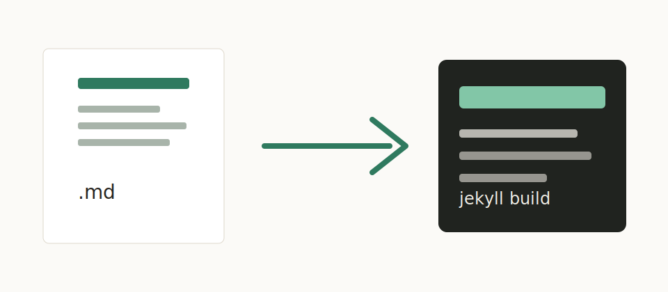

This post is stored as plain Markdown and can be edited directly in Obsidian.



## Local Assets

The image above lives beside this post:

```text
_posts/hello-world.md
_posts/hello-world/cover.svg
```

Obsidian can preview the relative path, and Jekyll publishes it under this post's final URL.

## Cards

> [!card] A Markdown-Friendly Card
> This is an Obsidian callout in the editor.
> The Jekyll build turns it into a styled card.

> [!poem] A Small Poem [demo]
> Keep the writing format readable first.
> Let the site build add presentation later.

## Runnable Code

```html runcode
<!doctype html>
<html>
<body>
  <button id="demo">Click me</button>
  <script>
    document.getElementById('demo').onclick = function () {
      document.body.insertAdjacentHTML('beforeend', '<p>Hello from runcode.</p>');
    };
  </script>
</body>
</html>
```

## Math

Inline math works when `obsidian_jekyll.mathjax` is enabled: $e^{i\pi} + 1 = 0$.

